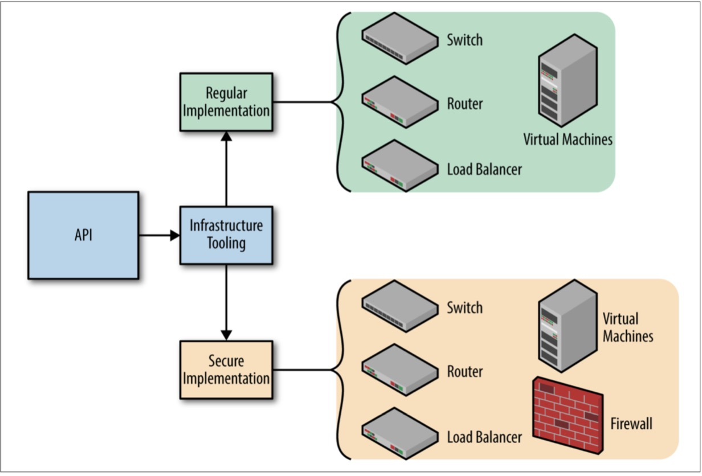

# 第5章 开发基础架构应用程序

在构建应用程序以管理基础架构时，您需要考虑将公开的API与您将创建的应用程序一样多。这些API将代表您的基础架构的抽象，而应用程序在基础架构中提供并使用API​​。

务必牢牢掌握两者的重要性，以及如何利用它们来创建可扩展的弹性基础架构。

在本章中，我们将举一个云原生应用程序和API的虚构示例，这些应用程序和API会经历正常的应用程序周期。如果您想了解更多有关管理云本机应用程序的信息，请参阅第7章。

##设计一个API

>这里的术语API是指处理数据结构中的基础架构表示，而不关心该表示如何暴露或消耗。通常使用HTTP RESTful端点来传递数据结构，但实现对本章并不重要。

不断发展的基础架构需要演变支持基础架构的应用程序。为这些应用程序设置的功能将随着时间而改变，因此基础架构将隐含地演变。随着基础架构的不断发展，管理它的应用程序也必须发展。

基础设施的功能，需求和新进展将永无止境。如果我们幸运的话，云提供商API将会保持稳定并且不会频繁更改。作为基础设施工程师，我们需要做好准备，以适应这些需求。我们需要准备好发展我们的基础架构和支持它的应用程序。

我们必须创建可缩放的应用程序，并准备对其进行扩展。为了做到这一点，我们需要了解在不破坏应用程序现有流程的情况下对应用程序进行大量更改的细微差别。

管理基础架构的工程应用程序的美妙之处在于它将操作员从其他人的意见中解放出来。

应用程序中使用的抽象现在由工程师来完成。如果一个API需要更多的文字，它可以;或者如果它需要被自以为是，并且被大量抽象出来，那可以。字面和抽象定义的强大组合可以为操作员准确地提供他们想要和需要管理基础架构的内容。

##添加功能

根据功能的性质，向基础设施应用程序添加功能可能非常简单或非常复杂。添加功能的目标是我们应该能够添加新功能而不会危害现有功能。我们绝不希望引入会以负面方式影响系统其他组件的功能。此外，我们一直希望确保系统输入在合理的时间内保持有效。

例5-1是本书前面介绍的演化基础设施API的具体示例。我们称之为API v1的第一个版本。

例5-1. v1.json

```json
{
    "virtualMachines": [{
        "name": "my-vm",
        "size": "large",
        "localIp": "10.0.0.111",
        "subnet": "my-subnet"
    }],
    "subnets": [{
        "name": "my-subnet",
        "cidr": "10.0.100.0/24"
    }]
}
```

想象一下，我们希望实施一项功能，允许基础架构运营商为虚拟机定义DNS记录。新的API看起来略有不同。在例5-2中，我们将定义一个称为版本的顶级指令，这会让我们的应用程序知道这是API的v2。我们还将添加一个新块，用于在虚拟机块的上下文中定义DNS记录。这是v1中不支持的新指令。

例5-2. v2.json

```json
{
    "version": "2",
    "virtualMachines": [{
        "name": "my-vm",
        "size": "large",
        "localIp": "10.0.0.111",
        "subnet": "my-subnet",
        "dnsRecords": [{
            "type": "A",
            "ttl": 60,
            "value": "my-vm.example.com"
        }]
    }],
    "subnets": [{
        "name": "my-subnet",
        "cidr": "10.0.100.0/24"
    }]
}
```

这两个对象都是有效的，应用程序应该继续支持它们。应用程序应检测到v2对象是否打算使用内置于应用程序中的新DNS功能。该应用程序应该足够聪明，以适当地导航新功能。将资源应用于云时，newv2对象的资源集将与第一个v1对象相同，但添加了单个DNS资源。

这引出了一个有趣的问题：应用程序应该如何处理较旧的API对象？应用程序仍应在云中创建资源，但支持无DNS的虚拟机。

随着时间的推移，操作员可以修改现有虚拟机对象以使用新的DNS功能。应用程序自然会检测到增量并为新功能创建DNS记录。

##弃用功能

让我们快速转到下一个API版本v3。在这种情况下，我们的API已经发展，我们已经与我们代表IP地址的方式陷入僵局。

在API v1的第一个版本中，我们能够通过本地IP指令方便地为网络接口声明一个本地IP地址。我们的任务是为我们的虚拟机提供多种网络接口。需要注意的是，这将与最初的v1 API相冲突。

让我们来看一下示例5-3中的v3新API。

例5-3. v3.json

```json
{
    "version": "2",
    "virtualMachines": [{
        "name": "my-vm",
        "size": "large",
        "networkInterfaces": [{
            "type": "local",
            "ip": "10.0.0.11"
        }],
        "subnet": "my-subnet",
        "dnsRecords": [{
            "type": "A",
            "ttl": 60,
            "value": "my-vm.example.com"
        }]
    }],
    "subnets": [{
        "name": "my-subnet",
        "cidr": "10.0.100.0/24"
    }]
}
```

使用定义多个网络接口所需的新数据结构，我们已弃用本地Ip指令。但是我们并没有删除定义IP地址的概念，我们只是简单地重组了它。这意味着我们可以开始在两个阶段贬低指令。首先，我们警告，然后我们否认。

在警告阶段，我们的应用程序可能会输出一个关于不再支持本地IP指令的相当糟糕的警告。应用程序可以接受在对象中定义的指令，并将旧的API版本v2转换为用户的新API版本v3。

翻译将采用为本地IP定义的值，并在新网络接口指令中创建与初始值相匹配的单个块。应用程序可以继续处理API对象，就好像用户发送了v3对象而不是v2对象一样。预计用户会注意到该指令已被弃用，并及时更新其表示。

在拒绝阶段，我们的应用程序将彻底拒绝v2 API。用户将被迫更新他们的API到更新的版本，或者在他们的基础设施中冒着人员伤亡的风险。

>**弃用是危险的**
>
>这是一个极其危险的过程，成功导航可能会非常困难。拒绝输入只能出于很好的理由。
>
>如果输入信息会在应用程序中破坏保证，则应拒绝该信息。否则，通常是警示并继续的最佳做法。
>
>打破用户的输入是一种简单的方法，可能会让您的操作员感到不安，甚至可能会伤及他人。

正在对API进行版本控制的基础架构工程师必须在何时适合弃用功能时使用他们的最佳判断。此外，工程师需要花时间尝试提出巧妙的解决方案，其中警告或翻译是适当的。在某些情况下，无声的翻译对不断发展的云本地基础架构是一个巨大的胜利。

##突变基础设施

基础设施需要随着时间的推移而变化或变化。这是云本地环境的本质。不仅应用程序频繁部署，而且运行基础架构的云提供商也在不断变化。

基础设施的变化可以有多种形式，比如扩大或缩小基础设施，复制整个环境或消耗新资源。

当运营商承担变更基础设施的任务时，可以观察API的真实价值。假设我们想要扩展环境中的虚拟机数量。不需要更改API版本，但对代表和我们的基础架构进行一些小的调整将很快反映我们的变化。就这么简单。

然而，重要的是要记住，在这种情况下，操作员可能是一个人，或者很可能是另一个软件。

请记住，我们故意将我们的API构造成易于被计算机解码。我们可以在API的两侧使用该软件！

> **使用运营商消费和生产API**
>
>构建云本地产品和平台的公司CoreOS，Inc.创造了术语运营商，即Kubernetes控制器，取代了人类参与管理特定应用的需求。他们通过协调预期的状态，以及设定预期的状态来做到这一点。
>
> CoreOS在他们的博客文章中以这种方式描述了运营商：
>
>操作员是特定于应用程序的控制器，它代表Kubernetes用户扩展Kubernetes API以创建，配置和管理复杂有状态应用程序的实例。它建立在基本的Kubernetes资源和控制器概念的基础上，但包含一个域或特定于应用程序的知识以实现常见任务的自动化。
>
>该模式规定操作员可以通过给定声明性指令集来更改环境。运营商是工程师应该创建的用于管理其基础架构的云本机应用程序类型的完美示例。

设想一个简单的情景是一个自动调节器。假设我们有一个非常简单的软件，可以检查环境中虚拟机上的平均负载。我们可以定义一个规则，只要平均负载平均值高于.7，我们就需要创建更多的虚拟机来均匀地分配我们的负载。

运营商的规则会随着负载平均值的增加而跳闸，最终运营商需要用另一台虚拟机更新基础设施API。这样可以扩大我们的基础架构，但同样容易，我们可以定义另一个规则以在负载平均降至.2以下。请注意，术语运营商在这里应该是一个应用程序，而不是一个人。

这是自动缩放的一个非常原始的例子，但是模式清楚地表明软件现在可以开始扮演人类操作员的角色。

有许多工具可以帮助扩展Kubernetes，Nomad和Mesos等基础设施上的应用程序负载。这假定应用程序层正在运行一个orchestrator，它将为我们管理这个。

为了进一步把基础设施​​API的价值化，想象一下，如果多个基础设施管理应用程序使用相同的API。这是一个非常强大的基础设施演进模式。

我们来看看相同的API--记住它只有几千字节的数据 - 并且针对两个独立的基础架构管理应用程序运行它。图5-1显示了两个基础架构应用程序如何从相同的API获取数据但将基础架构部署到两个独立的云环境的示例。


图5-1. 一个API被部署在两个云中

该模型为基础设施工程师提供了能够为多个云提供商提供通用抽象的强大功能。我们可以看到确保API的应用程序现在如何在多个地方代表基础架构。如果基础架构API负责提供自己的抽象和资源调配，则基础架构不必与单个云提供者的抽象相关联。用户可以在他们选择的云中创建独特的基础架构排列。

##维护云提供商兼容性

虽然保持API与云提供商的兼容性将会是很多工作，但在改变部署工作流程和供应流程时，这是很少的。请记住，人类比技术更难改变。如果您可以为人类保持一致的环境，它将抵消所需的技术开销。

您还应该权衡多云兼容性的好处。如果它不是您的基础设施的需求，您可以节省大量的工程工作。考虑锁定时请参阅附录B.

我们也可以推测在同一个云中运行不同的基础架构管理应用程序。这些应用程序中的每一个都可能会对API进行不同的解释并导致略有不同的基础结构根据定义基础架构的操作员的意图，管理应用程序之间的切换可能正是我们所需要的。图5-2显示了两个应用程序正在读取相同的API源，但根据环境和需要不同地实施数据。



图5-2. 一个API以不同的方式部署在同一个云中

##结论

与基础设施API相比，基础设施应用的排列是无止境的。这为基础设施工程师提供了一个非常灵活和可扩展的解决方案，希望能够以不同的环境和方式掌握基础设施。

我们为了满足基础设施要求而可能建立的各种应用现在已经成为基础设施本身的代表。这是第3章定义的软件基础设施的缩影。

请务必记住，我们构建的应用程序本身就是云本地应用程序。这是一个有趣的故事，因为我们正在构建云本地应用程序来管理云本地基础架构。
